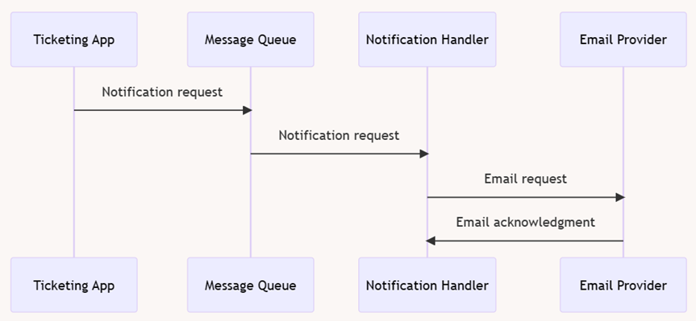
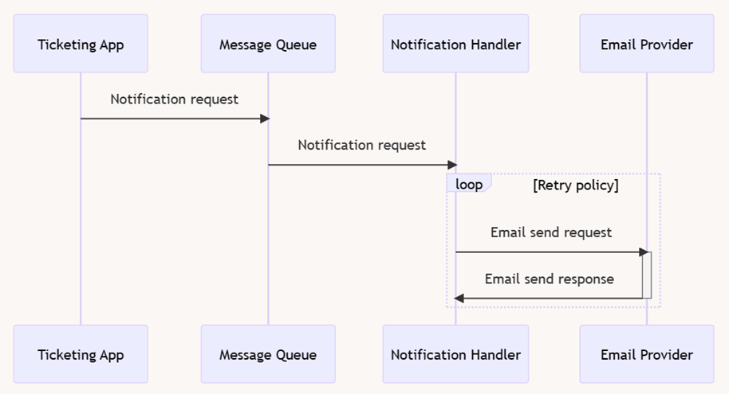

# Message queues

The goal of this module is to provide an overview of messaging concepts and familiarize yourself with the most popular
message queues implementations. Practical task includes implementation of the client-server application with
interactions based on messaging pattern.

### What should be done

Task 1:
In the home task we will implement a system of sending email notifications. In real world applications email
confirmations are usually sent to users on different business events, like placing an order, payment confirmation, etc.
The process of sending notifications should be asynchronous. General practice is message queues for this interaction
pattern.
You need to build a process according to the following diagram:

1. Ticketing application sends message to the message queue. You can use any message queue of your choice (Azure Service
Bus, RabbitMQ, etc.). Minimal set of data that you can include in the message:
- Notification tracking id (may be guid),
- Operation name (ticket added to checkout, ticket successfully checked out)
- Timestamp
- Notification parameters (customer email, customer name)
- Notification content (info that you need in the notification – order amount, order summary)
2. Notification handler is an intermediary service which retrieves messages from the message queue and prepares requests
for the actual processors. In our application notification handler will work only with email processor, but potentially
can work with multiple distribution channels (emails + sms). Notification handler creates an email request recognized by
the email provider.
On this step notification handler should notification request tatus in database to the ‘in progress’.
3. Email provider is an email messaging service. It may be a third-party public service like
Mailjet (https://www.mailjet.com/) or (https://sendgrid.com/). Pros of using these services is that you do not need to
have a SMPT mailbox and implement your own logic for creating envelopes.
Mailject and SendGrid are commonly used and provide REST API for forming and sending email envelopes. Notification
handler should trigger email provider API endpoint and wait for the result. Notification operation result could be shown
in console based on the status of the response (success – email is successfully sent, error – email provider returned
failure in the response).

Task 2:
Extend the logic of interaction between notification handler and email provider by implementing retry policy. You can
use Polly ( https://github.com/App-vNext/Polly) for setting retry policy for requests triggering Email provider API.

If the Email provider is unavailable or returns error Notification handler can retry sending the request in a period.
For the task it is enough to implement a 3-time retry policy with fixed time intervals.
